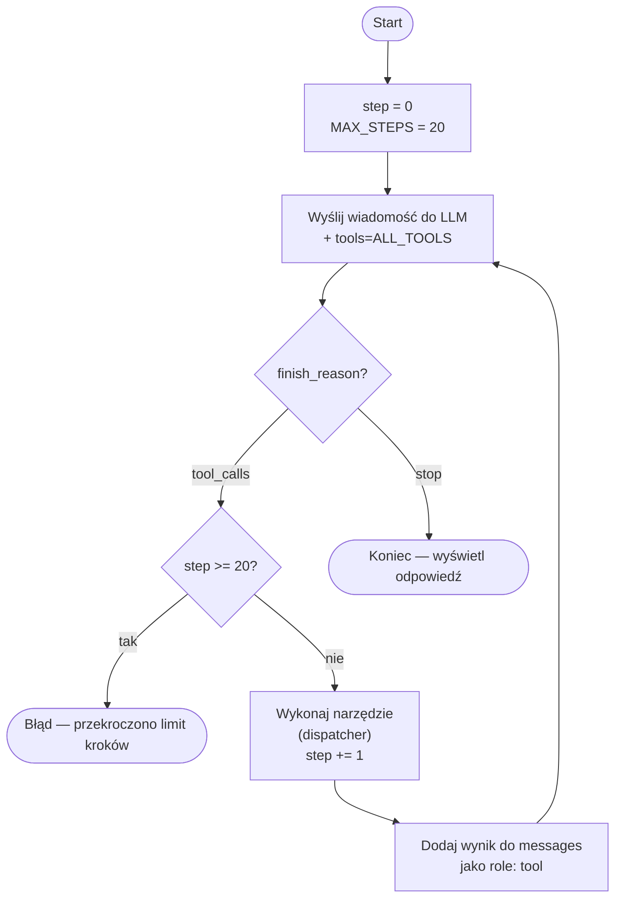

# Agent LLM z dostępem do wszystkich narzędzi

## Jak działa agent z narzędziami (tool use loop)



LLM sam decyduje kiedy i które narzędzie wywołać. Pętla trwa dopóki `finish_reason == "tool_calls"`.
Gdy LLM stwierdzi, że ma wystarczające informacje, kończy z `finish_reason == "stop"`.
Po przekroczeniu **20 kroków** pętla przerywa się i rzuca wyjątek `RuntimeError`.

## Wszystkie dostępne narzędzia

Z trzech plików łączymy `TOOL_DEFINITIONS` w jedną listę:

- `get_people_data.py` — `get_transport_people`, `refresh_people`
- `get_powerplants_location.py` — `fetch_power_plants`, `get_person_location`, `get_person_access_level`
- `geo_utils.py` — `get_city_coordinates`, `calculate_distance`

## Nowy plik `agent.py`

```python
import json, os
from dotenv import load_dotenv
from openai import OpenAI

from get_people_data import TOOL_DEFINITIONS as PEOPLE_TOOLS
from get_people_data import get_transport_people, refresh_people
from get_powerplants_location import TOOL_DEFINITIONS as LOCATION_TOOLS
from get_powerplants_location import fetch_power_plants, get_person_location, get_person_access_level
from geo_utils import TOOL_DEFINITIONS as GEO_TOOLS
from geo_utils import get_city_coordinates, calculate_distance

ALL_TOOLS = PEOPLE_TOOLS + LOCATION_TOOLS + GEO_TOOLS

TOOL_MAP = {
    "get_transport_people":    lambda _: get_transport_people(),
    "refresh_people":          lambda _: refresh_people(),
    "fetch_power_plants":      lambda _: fetch_power_plants(),
    "get_person_location":     lambda a: get_person_location(**a),
    "get_person_access_level": lambda a: get_person_access_level(**a),
    "get_city_coordinates":    lambda a: get_city_coordinates(**a),
    "calculate_distance":      lambda a: calculate_distance(**a),
}

MAX_STEPS = 20

def run_agent(user_message: str) -> str:
    messages = [{"role": "user", "content": user_message}]
    step = 0

    while True:
        response = client.chat.completions.create(
            model=os.getenv("OPEN_ROUTER_MODEL"),
            messages=messages,
            tools=ALL_TOOLS,
        )
        msg = response.choices[0].message
        messages.append(msg)

        if response.choices[0].finish_reason == "stop":
            return msg.content

        if step >= MAX_STEPS:
            raise RuntimeError(f"Agent przekroczył limit {MAX_STEPS} kroków bez odpowiedzi.")

        for tool_call in msg.tool_calls:
            args = json.loads(tool_call.function.arguments)
            print(f"[krok {step + 1}] narzędzie: {tool_call.function.name}, parametry: {json.dumps(args, ensure_ascii=False)}")
            result = TOOL_MAP[tool_call.function.name](args)
            print(f"          wynik: {json.dumps(result, ensure_ascii=False)[:200]}")
            messages.append({
                "role": "tool",
                "tool_call_id": tool_call.id,
                "content": json.dumps(result, ensure_ascii=False),
            })
            step += 1
```

## Kroki implementacji

- Stworzyć `agent.py` z funkcją `run_agent(user_message)` i pętlą tool use
- Zebrać wszystkie `TOOL_DEFINITIONS` z trzech plików w `ALL_TOOLS`
- Napisać dispatcher (`TOOL_MAP`) mapujący nazwy narzędzi na funkcje
- Wywołać agenta z przykładowym pytaniem w `if __name__ == "__main__"`
